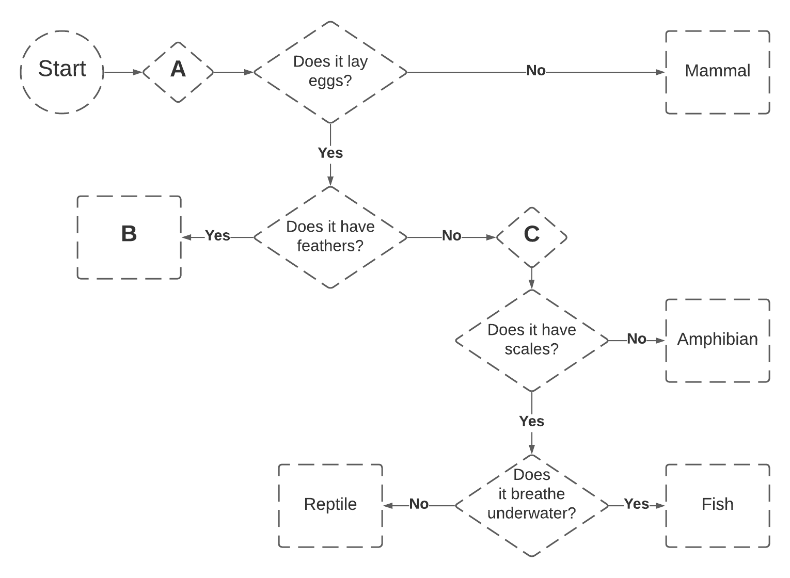

# Hi!

Welcome to the preview of a test I'm working on. Branch off and edit in your answers, or just jot them down and DM them to me, and let me know what you think. Too easy? Too hard? Not enough Maths? Spelling mistakes? Feedback welcome! _-Lucia_

##### **Question 1.** 

Here is a list of names and their corresponding meanings.

Amakiir (Gemflower)  
Amastacia (Starflower)  
Galanodel (Moonwhisper)  
Ilphelkiir (Gemblossom)  
Siannodel (Moonbrook)  
Liadon (Silverfrond)

Given that list of names, which of the following options would mean "Moonflower"?

a) Galastacia  
b) Amakiir  
c) Amanodel  
d) Ilphelnodel  

Answer: [ ]

##### **Question 2.**

Here is a list of names and their corresponding meanings.

Amakiir (Gemflower)  
Amastacia (Starflower)  
Galanodel (Moonwhisper)  
Ilphelkiir (Gemblossom)  
Siannodel (Moonbrook)  
Liadon (Silverfrond)

Given that list of names, what is the translation of Siankiir?

a) Moonblossom  
b) Gemfrond  
c) Gembrook  
d) It is impossible to know  

Answer: [ ]

##### **Question 3.**

Here is a list of names and their corresponding meanings.

Amakiir (Gemflower)  
Amastacia (Starflower)  
Galanodel (Moonwhisper)  
Ilphelkiir (Gemblossom)  
Siannodel (Moonbrook)  
Liadon (Silverfrond)

Given that list of names, which of the following options would mean "Moonfrond"?

a) Lianodel  
b) Liadnodel  
c) Galadon  
d) It is impossible to know  

Answer: [ ]

##### **Question 4.**

Jo is on a 3x3 grid, labelled ABC on the side and 123 on the top.

 &ensp; 1 &ensp;2&ensp; 3  
A&ensp;-&ensp; -&ensp; -  
B&ensp;-&ensp; -&ensp; -  
C&ensp;-&ensp; -&ensp; -  

Jo moves up one square, left one, and up again. She finishes on square 1A. What square did she start on?

a) 1C  
b) 2C  
c) B2  
c) 3C  

Answer: [ ]

##### **Question 5.**

Nat has a number. Nat adds 3, multiplies it by 2, subtracts 5, and divides it by 3. Her final number is 5. What number did Nat start with?

a) 7  
b) 8  
c) 2  
d) 3 2/3  

Answer: [ ]

##### **Question 6.**

In the following pattern there is a rule that every character must be paired with another matching character (a character is a letter, number, punctuation mark, or special character like the `@` symbol).

For example: `aa` and `bb@@` are both valid patterns. `aab` and `bbb`are invalid patterns, because not every character is in a pair.

You are given a pattern: `aa!!))`

Is this pattern valid?

a) Yes  
b) No  
c) It is impossible to know

Answer: [ ]

##### **Question 7.**

In addition to the rule in question 6, matching characters do not have to be next to each other, so long as they are still paired with a character elsewhere in the pattern. 

For example: `aa+==+` and `$<<??$` are valid patterns.

You are given a pattern: `%!b!%`

Is this pattern valid?

a) Yes  
b) No  
c) It is impossible to know

Answer: [ ]

##### **Question 8.**

In addition to the rules in questions 6 and 7, a character that is inside of another pair, must be matched within that pair.

For example: `ab++ba` and `-$aabb++$-` are valid, but `abab` and `+bab+a` are not.

You are given a pattern: `abc%%cba`

Is this pattern valid?

a) Yes  
b) No  
c) It is impossible to know

Answer: [ ]

##### **Question 9.**

You are given a pattern: `++aaaa++abba`

Applying the rules from questions 6, 7 and 8, is this pattern valid?

a) Yes  
b) No  
c) It is impossible to know

Answer: [ ]

##### **Question 10.**

You are given a pattern: `12ee33aa12`

Applying the rules from questions 6, 7 and 8, is this pattern valid?

a) Yes  
b) No  
c) It is impossible to know

Answer: [ ]

##### **Question 11.**

You have a pattern that contains the `%`, `a` and `=` characters. It is 6 characters long.

Applying the rules from questions 6, 7 and 8, is this pattern valid?

a) Yes  
b) No  
c) It is impossible to know

Answer: [ ]

##### **Question 12.**

You have a pattern that contains the `a`, `c`, and `+` characters. It is 25 characters long.

Applying the rules from questions 6, 7 and 8, is this pattern valid?

a) Yes  
b) No  
c) It is impossible to know

Answer: [ ]

##### **Question 13.**

What is the next number in the sequence?
1, 2, 6, 24, ___

a) 72  
b) 96  
c) 48  
d) 120  

Answer: [ ]

##### **Question 14.**

What is the next number in the sequence?
8, 28, 15, 35, 22, 42, __

a) 29  
b) 22  
c) 35  
d) 27  

Answer: [ ]

##### **Question 15.**

What is the next letter in the sequence?
a, d, f, i, k, __

a) n  
b) l  
c) m  
d) o  

Answer: [ ]

##### **Question 16.**

What is the next letter in the sequence?

a, a, b, a, b, c, a, b, _

a) b  
b) c  
c) d  
d) a  

Answer: [ ]

##### **Question 17.**

Looking at the following diagram, an animal in A:

a) Is a bird or a mammal  
b) Is a fish or a reptile  
c) Does not have feathers  
d) Could be any animal  

Answer: [ ]

##### **Question 18.**

Looking at the following diagram, an animal in B:

a) Does not lay eggs  
b) Has scales  
c) Could be any animal  
d) Is a bird  

Answer: [ ]

##### **Question 19.**

Looking at the following diagram, an animal in C:

a) Is a reptile or a fish  
b) Does not have scales  
c) Is not a bird  
d) Has scales  

Answer: [ ]

##### **Question 20.**

How to play noughts and crosses:  
One player picks O and the other picks X. On a 3x3 grid the players take turns picking a space and filling in their symbol. The winner is the first person to fill three squares in a row horizontally, vertically or diagonally. 

Len and Billie are playing noughts and crosses. Len is O, Billie is X.
 
 &ensp; &ensp; **&ensp;1 &ensp;2 &ensp;3**  
**A**: &ensp;x | _ | o  
**B**: &ensp;_ | _ | o  
**C**: &ensp; &ensp;| | x

What space in the grid does Billie (X) have to fill to win?

a) A2  
b) B2  
c) B1  
d) C2  

Answer: [ ]

##### **Question 21.**

Len and Billie are playing another round. Len is O, Billie is X.
 
 &ensp; &ensp; **&ensp;1 &ensp;2 &ensp;3**  
**A**: &ensp;o | x |&ensp;_   
**B**: &ensp;_ | _ |&ensp;_   
**C**: &ensp;x | |&ensp;o

What space in the grid does Billie (X) have to play to stop Len (O) from winning?

a) B1  
b) B2  
c) B3  
d) C2  

Answer: [ ]

##### **Question 22.**

 &ensp; &ensp; **&ensp;1 &ensp;2 &ensp;3**  
**A**: &ensp;x | _ |&ensp;o   
**B**: &ensp;_ | x |&ensp;o   
**C**: &ensp; &ensp;| |&ensp;

Based on this grid, who is **likely** to have played first?

a) X
b) O
c) Impossible to tell

Answer: [ ]

##### **Question 23.**

 &ensp; &ensp; **&ensp;1 &ensp;2 &ensp;3**  
**A**: &ensp;x | _ |&ensp;o   
**B**: &ensp;_ | x |&ensp;_   
**C**: &ensp; &ensp;| |&ensp;o

Based on this grid, who is **likely** to have played first?

a) X
b) O
c) Impossible to tell

Answer: [ ]

##### **Question 24.**

Jaime is learning a new language. Given these phrases and their translations:

"ebe e'doki a" (my handbag is heavy)  
"nuje b'doki a" (your handbag is light)  
"jandi ba a" (the cat is howling)  
"und" (happy)  
"na" (dog)  

How would he say "your dog is happy"?

a) und e'ba a  
b) na b'und a  
c) und b'na a  
d) jandi na a  

Answer: [ ]

##### **Question 25.**

CoolGame has 10 levels, which you can complete in any order. You can save your progress multiple times, in save slots. You can load a game and save your progress on the same save slot, or a new one.

For example, Syd can play level 1 and save their progress as "First try". Later, they can load "First try", play level 2, and save their progress under "Second try". When Syd checks the save progress, it would look like this:

First try:  1  
Second try: 1, 2

Safia, Bernie and Eliza buy a CoolGame console. Safia plays levels 1, 2 and 4. She saves her progress as "Saf".    
Bernard plays levels 5 and 7; he saves his progress as "Bernie".  
Eliza starts the game and decides to start playing on the "Saf" save. She completes level 7 and saves her progress as "Liz".

How many levels have been completed for each saved state?

a)
Saf: 1, 2, 4, 7
Bernie: 5, 7
Liz: 7

b)
Saf: 1, 2, 4
Bernie: 5, 7
Liz: 7

c)
Saf: 1, 2, 4
Bernie: 5, 7
Liz: 1, 2, 4, 7

d)
Saf: 1, 2, 4
Bernie: 5, 7
Liz: 1, 2, 4, 5, 7

Answer: [ ]
